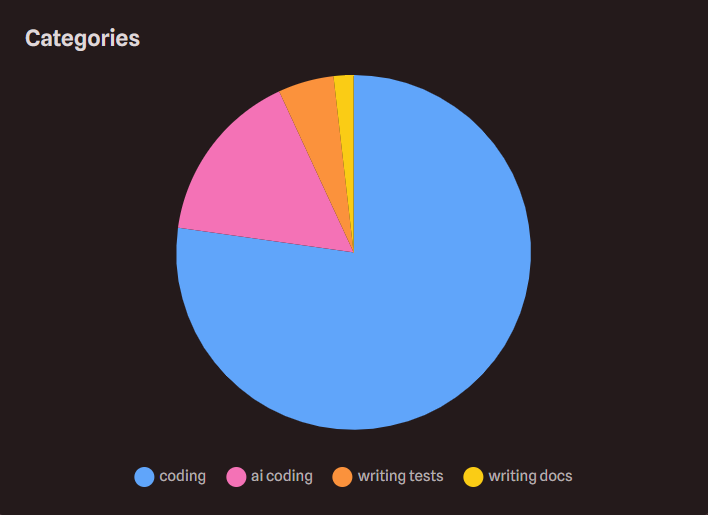
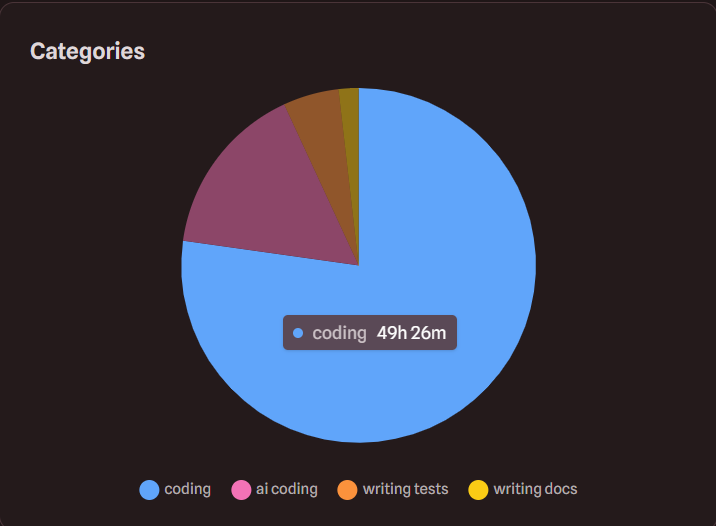
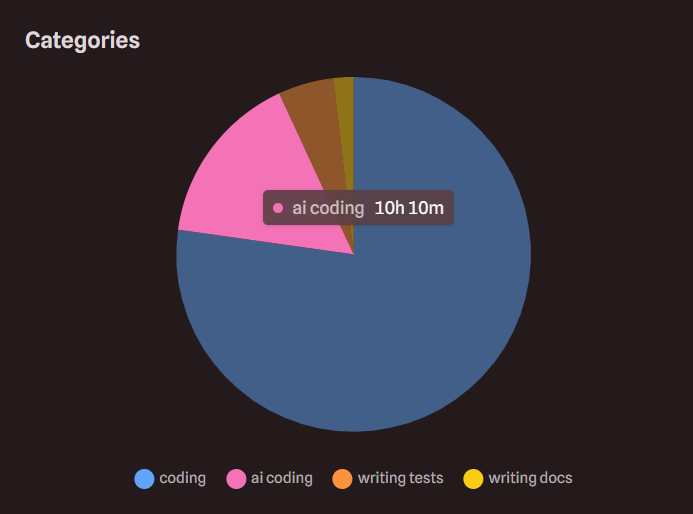

I have used AI for this project in multiple parts, mostly on the GUI. Although I did spent quite a lot of time learning the GUI so that I know what I am doing before I actually start working on my project.
I also took huge amount of help from AI to learn play with APIs, Json and Automation using Python. 

This is my AI vs Hand coding hours in case you want to know : 

## `Licence` is totally generated by AI.

## No AI was used in readme.md