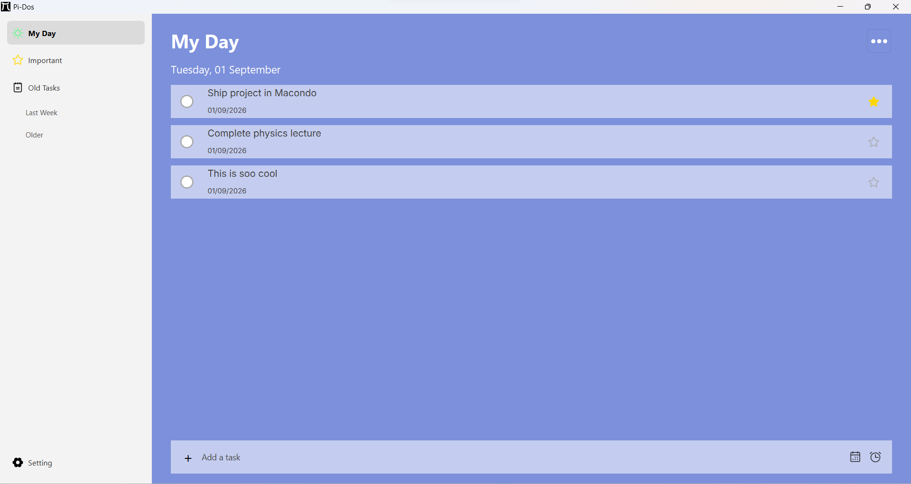
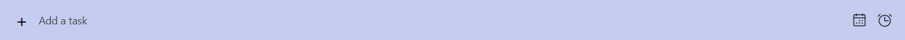
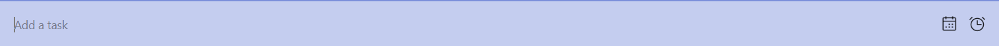

 

# **Pi-Dos**

Pidoes is a to-do app made using Python.

## Features

1. It has really clean and simple user interface which makes it intuitively easy to use.

2. You can create and schedule task by clicking on this label.

3. 
